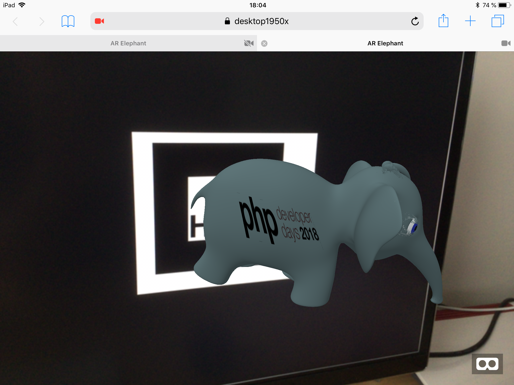

# AR-Elephant



```
docker-compose up -d
```

1. Then open your Desktop browser [https://localhost/HIRO.jpg](https://localhost/HIRO.jpg).
1. Open on your smartphone / camera device [https://[your host machine name / ip]/index.html](https://[your host machine name / ip]/index.html) (must be on the same network).

Ist must be a SSL connection. 

> Animated elephant (scene.gltf, scene.bin): [Elephant](https://sketchfab.com/models/a640a1099c604a928f39d44523cbd19d) by [Ozor](https://sketchfab.com/Ozor) under [CC BY 4.0](https://creativecommons.org/licenses/by/4.0/)